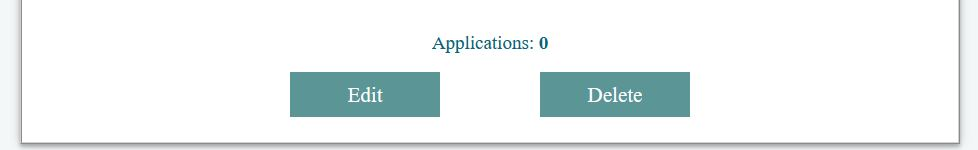

# Job Offers

This workshop is part of the SoftUni React course. The task is to write the functionality using React and React-router. The main idea of the workshop is to help participants better understand how routing in React works and to improve skills in handling state and other essential React concepts.

## Disclaimer

I'm trying my best to follow good coding practices and deliver a functional and educational project. However, I'm still in the early stages of my coding journey with React. Some parts of the code may not be optimal or adhere to best practices. I appreciate it if you give me feedback about errors that you find or want to help improve my code. 
## Table of Contents
- [Features](#features)
- [Overview](#overview)
- [Technologies Used](#technologies-used)
- [Installation](#installation)
- [License](#license)

## Features

- View a list of job offers on the dashboard.
- Click on a job offer to view detailed information.
- Create new job offers with various details.
- Edit existing job offers to update their information.
- Apply to job offers.
- User authentication and registration.
- Guards for unauthorized users, preventing access to specific URLs.

## Overview

### Home

The Home page serves as the starting point of the application, providing users with a navigation structure. It features navigation buttons that allow users to access every main page of the application, including the Dashboard, Job Details, Job Creation, and User Authentication pages. 

### Dashboard

Clicking on the "Dashboard" button in the navigation takes users to the Dashboard page. Here, users can view a list of job offers. Clicking on the "Details" button for any job offer leads users to the Job Details page.

### Job Details for user

The Job Details page presents users with information about a specific job offer. If the user is authenticated and has not yet applied for the offer, they will see an "Apply" button, allowing them to apply for the position. 

### Job Details for owner

If the user is the owner of this job offer instead of an "Apply" button, the owner sees buttons to "Edit" and "Delete" the offer. The "Edit" button allows owners to modify the offer's details, while the "Delete" button lets them remove the offer from the catalog. 

### Job Creation

Only authenticated users can create job offers within the application. 

### Job Editing

Authenticated users who are the owners of a job offer can edit their own offers. The "Edit" page presents a form with pre-populated fields containing the existing details of the job offer.

### User Authentication

To access certain CRUD (Create, Read, Update, Delete) operations and personalized functionalities, users are required to register and log in. 

## Technologies Used

- React
- React Router

## Installation

1. To download these files to your local machine you can use:

   Copy the link of the current folder and then put it [here](https://download-directory.github.io/) 

2. Navigate to the project's directory:
   
   cd app
   
3. Install the project dependencies:
   
   npm install

4. Start the practice server:

   node server.js

5. Start the server:

   npm start

## License

The HTML and CSS templates used in this project are provided by SoftUni University as part of the React course materials. All rights and credits for these templates belong to SoftUni.

The practice server used in this project is also provided by SoftUni as part of the course curriculum.

The remaining code and functionality implemented for this project are subject to the terms of the MIT License.
